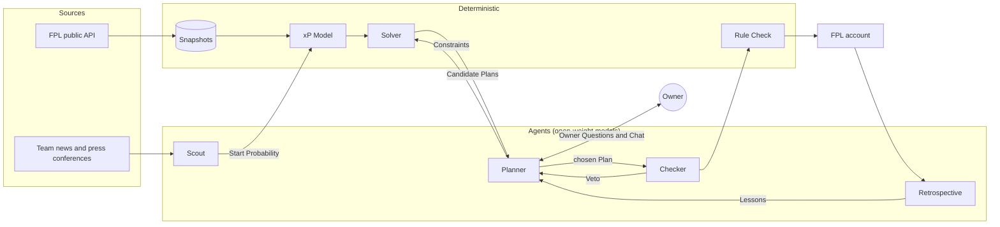

# 00 · Overview

**Status:** Decided · **Last updated:** 2026-10-02

## Problem

Fantasy Premier League (FPL) asks a manager to make a handful of linked decisions every Gameweek: transfers, starting eleven, captain and when to play Chips. Good decisions need two very different skills. One is arithmetic under constraints (a £100m budget, squad rules, multi-week transfer planning), which optimisers do far better than people or LLMs. The other is reading messy, late-breaking news (injuries, rotation, press conferences) and judging trade-offs the numbers can't see.

This project builds an agent that manages one real FPL team for the 2026/27 season with as little human input as possible, and measures honestly whether the LLM parts earn their cost.

## Goals

1. **Performance:** maximise the Season Total.
2. **Cost:** run the scheduled pipeline for under $5 a month, expected about $1.
3. **Observability:** every decision can be traced back through every model call, tool call and input that produced it.
4. **Evaluation:** show, with error bars, how many points each layer adds over a Solver-only baseline.

The Owner should also understand every part of it. Where a simpler design teaches more and costs little performance, prefer it.

## Non-goals

- **Maximising overall rank or beating a mini-league.** Rank is reported but never optimised (see `CONTEXT.md`, Season Total).
- **LLMs predicting points.** All numbers come from models and the Solver ([decision 0001](../decisions/0001-solver-writes-every-plan.md)).
- **Closed models.** Every agent runs on open-weight models ([decision 0002](../decisions/0002-open-weight-models-only.md)).
- **Managing other people's teams,** or any multi-user feature.
- **Chasing price changes.** Event-driven runs for price rises may come later as an experiment.

## The system on one page

Each Gameweek has two scheduled runs. The **Main Run**, about 24 hours before the deadline, builds a Plan and sends the Owner a Memo. The **Final Run**, about 2 hours before, re-checks the news, re-solves only on a Material Change, and executes. After the Gameweek, the **Retrospective** writes Lessons.

## Success metrics

| Metric | Target | Where it is measured |
|---|---|---|
| Points added over the Solver-only baseline | Positive, with a stated confidence interval | Paired Comparison ([06](06-evaluation.md)) |
| Season Total versus the Solver-only Shadow Team | Ahead at season end | Shadow Teams ([06](06-evaluation.md)) |
| Scout Brier score on starts | Better than FPL's own chance-of-playing flag | [06](06-evaluation.md) |
| Model spend | Under $5 every month | [07](07-observability-and-cost.md) |
| Missed deadlines | Zero | Run logs ([08](08-infrastructure.md)) |

"The agents add nothing over the Solver" is an acceptable, publishable result. The metrics exist to find out, not to confirm.

## Key design choices

| Choice | Why | Record |
|---|---|---|
| The Solver writes every Plan; agents only adjust inputs and choose | Legal Plans, arithmetic in code, measurable agent contribution | [0001](../decisions/0001-solver-writes-every-plan.md) |
| Open-weight models via OpenRouter | Cost | [0002](../decisions/0002-open-weight-models-only.md) |
| LangGraph, with Owner Questions as interrupts | Pause for the Owner and resume from a checkpoint | [0003](../decisions/0003-langgraph-with-owner-in-the-loop.md) |
| Public repo, private Postgres, public Snapshot repo | Free compute without publishing private state | [0004](../decisions/0004-public-code-private-state.md) |
| A Checker that can Veto, not a debating sceptic | Debate between similar agents rarely helps; a criteria-driven reviewer does | [research](../research/multi-agent-architecture.md) |
