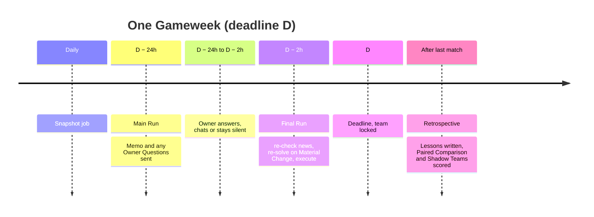
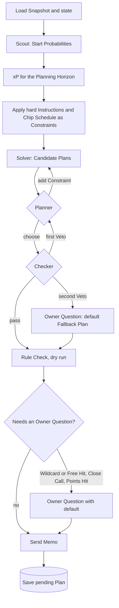
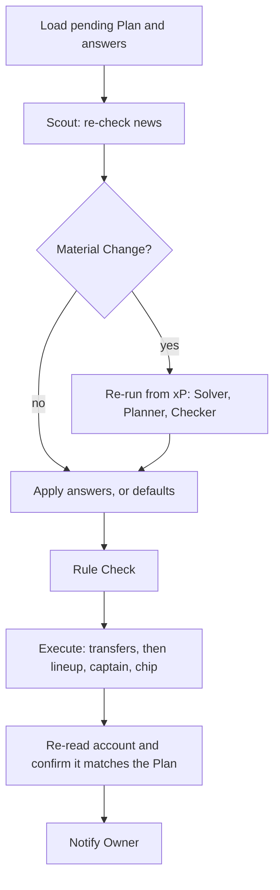

# 01 · Gameweek pipeline

**Status:** Decided, except where marked Proposed · **Last updated:** 2026-10-02

Every Gameweek follows the same fixed sequence. Code owns the sequence; agents are called only at the steps that need judgement ([research](../research/multi-agent-architecture.md): fixed workflows belong in code, not in an LLM orchestrator). Each run is a LangGraph graph checkpointed to Postgres after every node ([decision 0003](../decisions/0003-langgraph-with-owner-in-the-loop.md)).

## Timeline of one Gameweek

Run times derive from the deadline in the FPL API (`events[].deadline_time`), never from a fixed weekday, because deadlines move (Gameweek 8 is a Friday).

## Main Run

Notes:

- **The Planner's re-solve loop is capped** (Proposed: three re-solves) so a confused Planner can't burn the Spend Cap.
- **The Main Run executes nothing.** Its output is a pending Plan, stored with its Owner Questions and their defaults.
- **Owner Questions don't block the run.** The graph pauses on a LangGraph interrupt; the answer, or the default at the Final Run, resumes it.

## Final Run

Notes:

- **On a Material Change the Final Run re-plans without new Owner Questions**, since there may be no time to answer; anything that would have needed one takes its default. The Memo says so.
- **Execution order matters.** Transfers first, then the lineup and captain for the new squad. Wildcard and Free Hit are played with the transfers; Bench Boost and Triple Captain with the lineup ([feasibility research](../research/fpl-api-feasibility.md)).
- **Execution is idempotent per Gameweek.** A retried Final Run that finds its transfers already made skips straight to the lineup.

## Retrospective (after the Gameweek)

Runs once the Gameweek's last match is final (`event-status/` reports points as confirmed). It scores the Paired Comparison and Shadow Teams, scores the Scout's Start Probabilities, and asks the Retrospective agent for Lessons ([03](03-agents.md)).

## Failure behaviour

| Failure | Behaviour |
|---|---|
| A model call fails or times out | Retry with backoff, then the step's fallback: Scout falls back to FPL's chance-of-playing flag; Planner and Checker failures fall back to the Fallback Plan |
| Spend Cap reached | Stop spending; play the Fallback Plan |
| Main Run missed entirely | Final Run runs the whole Main Run sequence with no Owner Questions |
| Final Run fails to execute | Retry until 30 minutes before the deadline, then alert the Owner by Telegram with the exact moves to make by hand |
| FPL login expired | Alert the Owner to log in again; execution waits for it until the 30-minute alert |

The team is always in a legal state, because FPL keeps the previous lineup if nothing is sent. A missed run costs points, never the team.
