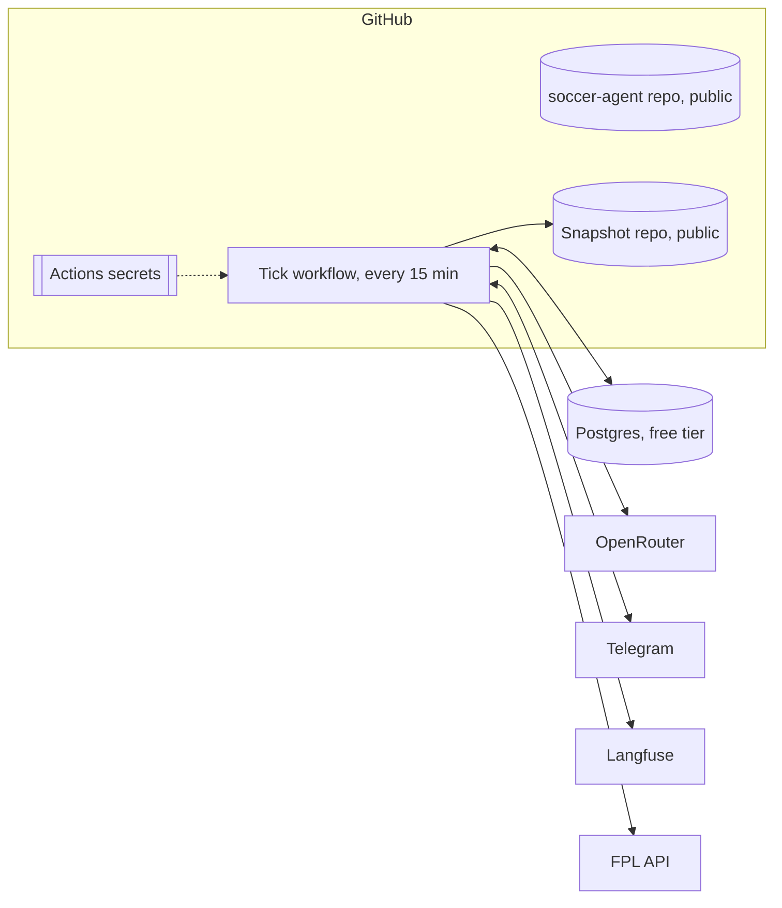

# 08 · Infrastructure

**Status:** Decided in shape; providers Proposed · **Last updated:** 2026-10-02

Everything runs on free tiers except model calls ([07](07-observability-and-cost.md)). The Owner's laptop is never needed for a scheduled run.

## Components



## One scheduler

A single GitHub Actions workflow runs every 15 minutes (the **tick**). Each tick:

1. Reads new Telegram messages; answers Chat; records Owner Question answers and resumes their paused runs.
2. Checks the current deadline from the FPL API, and starts the Main Run, Final Run or Retrospective when one is due and hasn't run yet.
3. Takes the daily Snapshot when one is due.
4. Exits within seconds when there's nothing to do.

Each tick is split into jobs so that secrets never share a job with repository code ([decision 0005](../decisions/0005-secrets-never-share-a-job-with-repo-code.md)). Today: `check` asks the GitHub API whether today's Snapshot exists (failing closed on any API error), `snapshot` runs our code with no secrets, and `publish` holds the deploy key in a `main`-only environment and only runs git. A manual run can force a Snapshot.

Runs are recorded in Postgres with their Gameweek and type, so a delayed or repeated tick never starts the same run twice. GitHub may start scheduled jobs late under load; the Final Run's 2-hour margin covers that, and the failure rules in [01](01-gameweek-pipeline.md) cover the rest.

A manual trigger (`workflow_dispatch`) can start any run for testing or recovery.

## Storage

| Store | Contents | Provider (Proposed) |
|---|---|---|
| Postgres | LangGraph checkpoints, pending Plans, Owner Questions, Instructions, Lessons, decision log, Shadow Teams, encrypted FPL token, run registry | Neon or Supabase free tier, chosen after checking current limits and pause rules |
| Snapshot repo | Raw gzipped API Snapshots, never edited | Public GitHub repo `eicyer/fpl-snapshots` |
| Code repo | Code, docs, prompts, regression cases | `eicyer/soccer-agent`, public |

Snapshots are taken daily, at the start of every run, and after each Gameweek's points are confirmed. Roughly 60 MB a month.

## Code layout (Proposed)

```text
src/football_agent/
  data/          Snapshot fetching and parsing
  xp/            FPL xP adapter, later the xP Model
  solver/        MILP formulation, Candidate Plans, Rule Check
  agents/        Scout, Planner, Checker, Retrospective, Chat responder
  graph/         LangGraph graphs for Main Run, Final Run, Retrospective
  execution/     FPL auth and the write path
  owner/         Telegram bot, Owner Questions, Instructions
  evals/         Paired Comparison, Shadow Teams, component evals
  mcp/           Thin MCP server over the tool functions
prompts/         One versioned file per agent
evals/cases/     Regression suite
```

Python 3.12+, managed with `uv`. Tests with `pytest`; anything touching squad rules, budget or execution is tested first (`CLAUDE.md`).

## Local development

- **Local models through Ollama.** Its API is OpenAI-compatible, like OpenRouter's, so switching between local and hosted models is a base URL and model name. The Owner's M4 Pro with 24 GB runs mid-sized models (roughly up to 30B parameters, quantised).
- **Same graphs, dry run by default.** Local runs never execute writes.
- **Replay:** any past run can be re-run from its stored inputs with a different prompt or model, which is how prompt changes are evaluated.

## MCP server

A thin server, using the current MCP Python SDK over stdio, wraps the same tool functions the agents call (`candidate_plans`, `score_plan`, `player_xp`, `rule_check`, plus read-only team state). It lets the Owner explore the team from Claude Desktop or Claude Code. It's read-only: no execution tools, ever. Built after the pipeline (Roadmap, [09](09-roadmap.md)).

## Secrets

Listed in [05](05-execution-and-safety.md). Before the repo goes public, the history is checked for anything that shouldn't be published.
